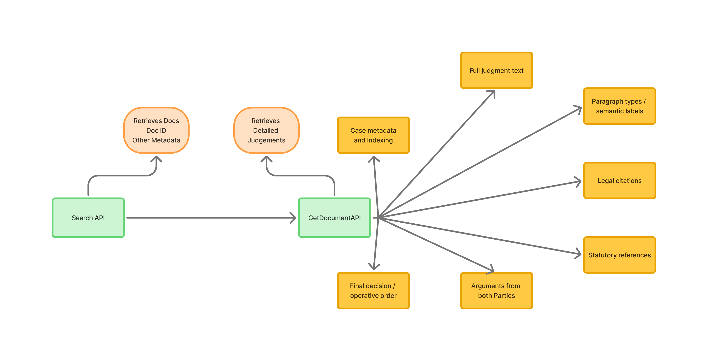

# CaseMind ⚖️

CaseMind is a Legal AI system designed to answer queries on Indian Supreme Court judgments using a Retrieval-Augmented Generation (RAG) pipeline.

## Features (Planned)

- Supreme Court judgment ingestion
- Semantic + keyword hybrid search
- Context-aware legal Q&A
- Evaluation pipeline for answer quality
- Legal metadata extraction and indexing

## Tech Stack

- FastAPI
- Vector DB (TBD)
- PostgreSQL
- Open-source LLMs

## Current Progress

- Legal search API structure analysis completed
- Search response decomposition completed
- Initial system architecture planning in progress
- Metadata structure mapping completed

---

# Level 1 Architecture

The following diagram represents the structure of the legal search API response.

It includes:
- Request search URL
- API response decomposition
- Category/filter metadata
- Pagination/query metadata
- Document metadata records

---

# Search API Response Structure

The legal search API currently returns:

{
  "categories": [...],
  "docs": [...],
  "found": "1 - 10 of 7145",
  "encodedformInput": "fromdate:23-04-2026 todate:13-05-2026"
}

# Level 2 Architecture

The following diagram represents the structure of the detailed judgment retrieval pipeline.

After retrieving document identifiers from the Search API, the system calls the `GetDocumentAPI` to fetch a fully structured judgment.

The extracted judgment intelligence currently includes:

- Case metadata and indexing
- Full judgment text
- Paragraph semantic labels
- Legal citations
- Statutory references
- Party arguments
- Final decision / operative order

This structured representation is intended to support:
- Semantic legal retrieval
- Metadata-aware chunking
- Citation graph analysis
- Legal RAG pipelines
- Downstream legal AI workflows

### Implemented ORM Models

#### JudgmentMetadata

Initial production metadata model for legal judgment indexing and retrieval.

The model currently captures:

- Core judgment identity and source metadata
- Document classification and publication information
- Search and retrieval metadata returned by the API
- Citation statistics and document characteristics
- Source payload preservation (`raw_json`)
- Audit and ingestion timestamps

This model forms the foundation for:

- Metadata-driven legal search
- Retrieval filtering and ranking
- Future hybrid search pipelines
- Citation graph expansion
- Downstream Legal RAG workflows