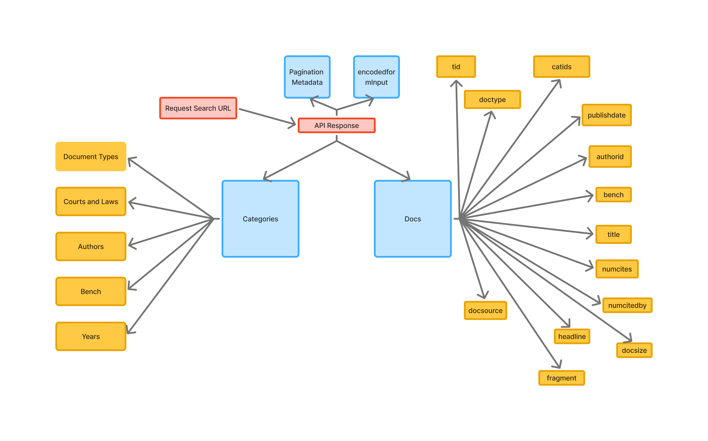

# CaseMind ⚖️

CaseMind is a Legal AI system designed to answer queries on Indian Supreme Court judgments using a Retrieval-Augmented Generation (RAG) pipeline.

## Features (Planned)

- Supreme Court judgment ingestion
- Semantic + keyword hybrid search
- Context-aware legal Q&A
- Evaluation pipeline for answer quality
- Legal metadata extraction and indexing

## Tech Stack

- FastAPI
- Vector DB (TBD)
- PostgreSQL
- Open-source LLMs

## Current Progress

- Legal search API structure analysis completed
- Search response decomposition completed
- Initial system architecture planning in progress
- Metadata structure mapping completed

---

# Level 1 Architecture

The following diagram represents the structure of the legal search API response.

It includes:
- Request search URL
- API response decomposition
- Category/filter metadata
- Pagination/query metadata
- Document metadata records



---

# Search API Response Structure

The legal search API currently returns:

```json
{
  "categories": [...],
  "docs": [...],
  "found": "1 - 10 of 7145",
  "encodedformInput": "fromdate:23-04-2026 todate:13-05-2026"
}